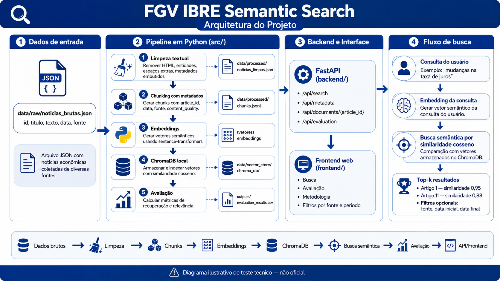

# FGV IBRE Semantic Search

Mini motor de busca semântica para notícias econômicas brasileiras, com limpeza textual, embeddings via `sentence-transformers`, ChromaDB e avaliação de ranking.

## Acesso rápido

A aplicação está disponível temporariamente em:

```text
https://fgv-ibre-semantic-search-4nntyuikca-uc.a.run.app/
```

O deploy foi feito no Google Cloud Run. A imagem de deploy executa o pipeline durante o build, portanto a demo online já fica pronta para uso: para testar a interface, o avaliador não precisa baixar modelo, gerar embeddings ou criar o banco ChromaDB localmente.

A demo online roda no Google Cloud Run. A primeira busca pode demorar cerca de 40 segundos a 1 minuto caso a aplicação esteja inativa há algum tempo, por causa da inicialização do serviço. O pipeline já foi executado no build, então não é necessário baixar modelos ou gerar embeddings para usar o site. A entrega principal continua sendo a solução reproduzível em Python descrita abaixo.

## Formas de execução

### Demo online

Acesse:

```text
https://fgv-ibre-semantic-search-4nntyuikca-uc.a.run.app/
```

### Execução local com Python

Linux/macOS:

```bash
git clone https://github.com/MtHenriqueF/fgv-ibre-semantic-search.git
cd fgv-ibre-semantic-search

python -m venv .venv
source .venv/bin/activate
pip install --upgrade pip
pip install -r requirements.txt

python run_pipeline.py
uvicorn backend.main:app --reload
```

Windows:

```powershell
git clone https://github.com/MtHenriqueF/fgv-ibre-semantic-search.git
cd fgv-ibre-semantic-search

python -m venv .venv
.venv\Scripts\activate
pip install --upgrade pip
pip install -r requirements.txt

python run_pipeline.py
uvicorn backend.main:app --reload
```

Depois, acesse:

```text
http://127.0.0.1:8000
```

A documentação automática da API fica disponível em:

```text
http://127.0.0.1:8000/docs
```

Na primeira execução local, o download do modelo de embeddings pode levar alguns minutos. Na demo online, o modelo e o índice já foram preparados no build da imagem.

### Execução com Docker

```bash
docker compose up --build
```

Depois, acesse:

```text
http://localhost:8000
```

O Docker é opcional. Ele serve para empacotar o ambiente e facilitar a reprodução local; a execução direta com Python continua sendo suportada.

### Uso via CLI

```bash
python -m src.search "mudanças na taxa de juros"
python -m src.search "mercado de trabalho e desemprego"
python -m src.search "inflação e preços ao consumidor"
python -m src.search "inflação e preços ao consumidor" --top-k 5
python -m src.search "receita de bolo de chocolate" --min-similarity 0.35
```

## Escopo da entrega

### Núcleo exigido pelo desafio

O núcleo técnico exigido está em `src/` e cobre:

- limpeza e tratamento textual;
- geração de `data/processed/noticias_limpas.json`;
- geração de chunks com metadados;
- geração de embeddings com `sentence-transformers`;
- indexação local em ChromaDB;
- busca semântica por similaridade cosseno;
- avaliação das queries obrigatórias com métricas de ranking.

### Camadas adicionais

Além do núcleo pedido no desafio, o projeto inclui:

- API FastAPI em `backend/`;
- frontend web estático em `frontend/`;
- modo de avaliação na interface;
- Docker para empacotamento local;
- deploy temporário no Google Cloud Run.

Essas camadas adicionais facilitam a inspeção e a reprodução, mas não substituem a solução Python solicitada no desafio.

## Estrutura do projeto

```text
fgv-ibre-semantic-search/
├── data/          # dados brutos, processados e banco vetorial local reconstruível
├── evaluation/    # queries obrigatórias e julgamentos manuais de relevância
├── outputs/       # relatórios e resultados gerados
├── src/           # núcleo técnico: limpeza, embeddings, ChromaDB, busca e métricas
├── tests/         # testes automatizados dos componentes principais
├── backend/       # API FastAPI que expõe a solução
├── frontend/      # interface web para facilitar a avaliação visual
├── Dockerfile
├── docker-compose.yml
├── requirements.txt
├── README.md
└── run_pipeline.py
```

## Pipeline principal em Python


### Visão visual do pipeline

A imagem abaixo resume o fluxo principal da solução: os dados brutos são limpos, transformados em chunks com metadados, convertidos em embeddings com `sentence-transformers`, indexados em um ChromaDB local e recuperados por busca semântica com similaridade cosseno. A avaliação utiliza queries obrigatórias e julgamentos manuais de relevância para calcular métricas de ranking.

> **Aviso sobre identidade visual:** o uso de elementos visuais associados ao FGV IBRE nesta imagem tem finalidade exclusivamente ilustrativa e contextual para o desafio técnico. Este projeto não representa um produto oficial da FGV, da FGV IBRE ou de qualquer unidade da instituição.



O fluxo reproduzível do projeto é:

```text
data/raw/noticias_brutas.json
        ↓
limpeza textual
        ↓
data/processed/noticias_limpas.json
        ↓
chunks com metadados
        ↓
embeddings
        ↓
ChromaDB local
        ↓
busca semântica
        ↓
avaliação de ranking
```

O comando principal é:

```bash
python run_pipeline.py
```

Ele reconstrói os artefatos necessários para a busca a partir do arquivo bruto do desafio. O pipeline gera os textos limpos, os chunks e o índice vetorial local usado pela busca semântica.

O ChromaDB armazena documentos, embeddings e metadados separadamente. O texto enviado ao embedding é mantido como linguagem natural, enquanto campos como `article_id`, `data`, `fonte` e `content_quality` ficam em metadados estruturados para filtros e exibição.

## Avaliação da busca semântica

A avaliação obrigatória usa as três consultas do desafio:

- `"mudanças na taxa de juros"`
- `"mercado de trabalho e desemprego"`
- `"inflação e preços ao consumidor"`

As métricas são calculadas apenas para essas consultas, pois elas possuem julgamentos manuais de relevância em `evaluation/relevance_judgments.json`. Para consultas livres digitadas pelo usuário, o sistema exibe distância cosseno e similaridade aproximada, mas não calcula `Precision`, `Recall`, `MRR` ou `nDCG` sem julgamentos manuais associados.

A similaridade cosseno indica proximidade vetorial entre consulta e documento. Já as métricas de ranking avaliam se os documentos considerados relevantes aparecem nas primeiras posições do resultado.

Métricas usadas:

| Métrica | Interpretação |
| --- | --- |
| `Precision@3` | proporção de documentos relevantes entre os 3 primeiros resultados |
| `Recall@5` | proporção dos documentos relevantes recuperada nos 5 primeiros resultados |
| `MRR` | posição do primeiro documento relevante |
| `nDCG@5` | qualidade da ordenação considerando relevância graduada |

Resultados atuais em `outputs/evaluation_results.csv`:

| Query | Precision@3 | Recall@5 | MRR | nDCG@5 | Artigos recuperados |
| --- | ---: | ---: | ---: | ---: | --- |
| mudanças na taxa de juros | 1.000000 | 1.000000 | 1.000000 | 0.972898 | `[1, 11, 10, 6, 7]` |
| mercado de trabalho e desemprego | 1.000000 | 0.750000 | 1.000000 | 0.965119 | `[14, 4, 19, 3, 15]` |
| inflação e preços ao consumidor | 0.666667 | 0.375000 | 1.000000 | 0.512367 | `[9, 11, 15, 1, 20]` |

Arquivos úteis:

- `evaluation/queries_obrigatorias.json`
- `evaluation/relevance_judgments.json`
- `outputs/evaluation_results.csv`
- `outputs/search_examples.json`

## Escolha do modelo de embedding

A escolha do modelo de embedding foi tratada como uma decisão experimental, não arbitrária. Como o corpus é formado por notícias econômicas curtas em português brasileiro, priorizei modelos:

- compatíveis com `sentence-transformers`;
- multilíngues ou adequados a português;
- públicos e gratuitos no Hugging Face;
- leves o suficiente para execução local;
- adequados à tarefa de busca semântica.

Foram comparados:

- `intfloat/multilingual-e5-small`
- `sentence-transformers/paraphrase-multilingual-MiniLM-L12-v2`

Ambos foram carregados com a biblioteca `sentence-transformers`. A comparação manteve fixos os dados limpos, os chunks, as queries obrigatórias, a métrica cosseno e os julgamentos manuais de relevância; assim, a principal variável experimental foi o modelo de embedding.

Para avaliar o ranking, foram criados julgamentos manuais de relevância, também chamados de qrels. Cada documento recebeu uma nota por consulta:

- `0`: irrelevante
- `1`: parcialmente relevante
- `2`: relevante
- `3`: altamente relevante

As métricas usadas foram `Precision@3`, `Recall@5`, `MRR` e `nDCG@5`, pois elas verificam se os documentos relevantes aparecem nas primeiras posições do ranking. A escolha do modelo não foi feita por similaridade cosseno absoluta, já que valores de similaridade não são diretamente comparáveis entre modelos diferentes.

Resultados reais da comparação em `outputs/embedding_evaluation.csv`:

| Modelo | Precision@3 médio | Recall@5 médio | MRR médio | nDCG@5 médio | Média aritmética |
| --- | ---: | ---: | ---: | ---: | ---: |
| `intfloat/multilingual-e5-small` | 0.666667 | 0.708333 | 1.000000 | 0.873375 | 0.812094 |
| `sentence-transformers/paraphrase-multilingual-MiniLM-L12-v2` | 0.888889 | 0.708333 | 1.000000 | 0.816795 | 0.853504 |

O `multilingual-e5-small` obteve `nDCG@5` maior, enquanto o `paraphrase-multilingual-MiniLM-L12-v2` obteve `Precision@3` maior; `Recall@5` e `MRR` empataram. Considerando a média aritmética das métricas e a simplicidade de manter o modelo já integrado ao projeto, o modelo principal preservado foi `sentence-transformers/paraphrase-multilingual-MiniLM-L12-v2`.

## Frontend e backend como camada adicional

O frontend foi criado para facilitar a avaliação visual do motor de busca. Ele usa uma identidade limpa e institucional, inspirada visualmente na comunicação do FGV IBRE, e possui três abas:

- **Busca**: consulta em linguagem natural, filtros e resultados com similaridade;
- **Avaliação**: métricas das queries obrigatórias;
- **Metodologia**: explicação resumida do pipeline e dos indicadores.

O backend usa FastAPI apenas como camada de exposição da solução. Ele não duplica a lógica principal do projeto; os endpoints chamam funções implementadas em `src/`.

Endpoints principais:

| Método | Endpoint | Uso |
| --- | --- | --- |
| `POST` | `/api/search` | executar busca semântica |
| `GET` | `/api/metadata` | listar filtros disponíveis |
| `GET` | `/api/documents/{article_id}` | recuperar notícia limpa completa |
| `GET` | `/api/evaluation` | obter métricas e resultados avaliados |
| `GET` | `/health` | verificar disponibilidade da API |

## Docker e deploy

O Docker é usado para empacotar a aplicação e facilitar reprodução local e deploy, mas não é obrigatório para executar o núcleo em Python.

No deploy do Google Cloud Run, o pipeline é executado durante o build da imagem. Assim, quando o avaliador acessa o link público, o site já está pronto para uso com o modelo baixado, os embeddings gerados e o ChromaDB preparado.

## Limitações e próximos passos

- O corpus possui apenas 20 notícias fictícias.
- Os julgamentos de relevância foram criados manualmente para as queries obrigatórias.
- O ChromaDB é usado localmente porque o objetivo é demonstrar o pipeline, não operar um sistema de produção.
- Como evolução, seria possível adicionar busca híbrida com BM25, reranking com CrossEncoder e avaliação com um conjunto maior de queries.